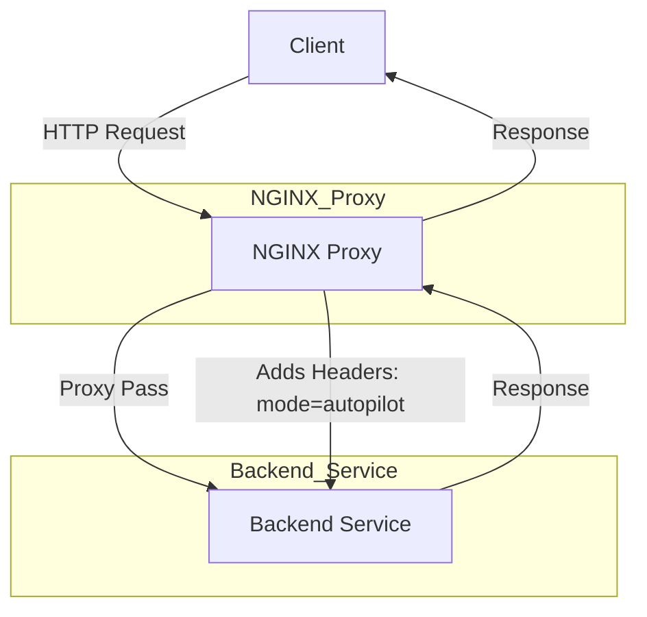

This is a sample nginx reverse proxy demo

### Explanation:
1. **Client**:
   - Represents the user or external system sending HTTP requests.

2. **NGINX Proxy**:
   - Acts as a reverse proxy, forwarding requests to the backend service.
   - Adds custom headers like `mode=autopilot`.

3. **Backend Service**:
   - Processes requests and sends responses back to the NGINX proxy.

4. **Arrows**:
   - Show the flow of requests and responses between components.

You can copy and paste this into a Markdown file, and it will render as a diagram if your Markdown viewer supports Mermaid (e.g., GitHub, VS Code with Mermaid extensions). Let me know if you need further assistance!
